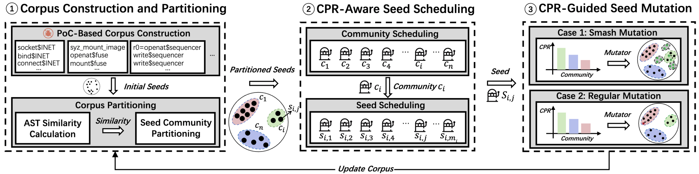

# SyzDiversity: Diversity-Guided Linux Kernel Fuzzing

---

[](LICENSE)
[](https://python.org/)
[](https://kernel.org/)

## Overview


Linux kernel vulnerabilities can pose severe security threats to the entire software ecosystem. While coverage-guided kernel fuzzers have been proposed to uncover such vulnerabilities, their code coverage and bug-finding capability are still limited due to the lack of seed diversity, which is caused by the compounding effect of initial seed generation, seed scheduling, and seed mutation. To address this limitation, we propose a diversity-guided kernel fuzzer **SyzDiversity**. Specifically, to mitigate overvaluation of early seeds, **SyzDiversity** leverages proof-of-concept (PoC) seeds derived from real-world vulnerabilities as initial seeds, and further partitions these seeds into multiple communities. Moreover, to improve diversity guidance in seed scheduling, it leverages a novel metric, community popularity rate (CPR), to model community diversity, and introduces a CPRaware hierarchical Multi-Armed Bandit (MAB) algorithm that integrates CPR and code coverage as reward signals to prioritize the scheduling of diverse seed communities and seeds. Further, to efficiently populate sparse communities or break through community boundaries, it adopts a CPR-guided seed mutation strategy that adaptively allocates higher mutation frequencies to communities that are more conducive to the diversity evolution of the seeds. Our extensive experiments on Linux kernel versions v5.15 and v6.14 demonstrate that **SyzDiversity** improves code coverage and bugfinding capability by 17.4% and 10.2×, respectively, compared to the state-of-the-art kernel fuzzers. It has successfully discovered 31 unique new vulnerabilities, with 11 of them confirmed.

---

## ✨ Novel Features

- 🔍 **Diversity-Guided Kernel Fuzzing**: Enhancing Kernel Fuzzing with Community Diversity
- 🌱 **Valuable Initial Seed Corpus**: Partitioned PoCs Seeds at the Ealy Edge
- 🌳 **AST-based Partitioning**: Community Detection and Partition within AST-based Seed Corpus
- 📊 **Advanced Similarity Metrics**: Multiple Normalization Methods (NTED1, NTED2, NTED3, MinMax)
- 🎯 **Community Center Detection**: Dynamic Identification of the Central Seed in a Community
- 🚦 **CPR-Aware Scheduling**: A Novel Metric for Seed Scheduling
- 🧬 **CPR-Guided Mutation**: A Mutation Strategy for Rapidly Populating Sparse Community
- 📈 **Extensive Experiments**: Comprehensive Experimental Evaluation

---

## 🗂️ Project Structure Overview
| Folder | Description |
| ------ | ----------- |
| [cluster_code](./cluster_code/) | 🧩 **Corpus construction and partitioning (Phase 1)** for SyzDiversity, including PoCs storage, AST conversion, similarity computation, and clustering. |
| [SyzDiversity_code](./SyzDiversity_code/) | ⚙️ Fuzzer engine with **CPR-Aware Scheduling (Phase 2)**, **CPR-Guided Seed Mutation (Phase 3)**, and the enhanced syzkaller framework. |
| [fig](./fig/) | 🖼️ Key figures used in the paper. |
| [prepared_data](./prepared_data/) | 🌱 Diverse initial seed sets for Fuzzing Campaign and experimental evaluation. |
| [evaluation](./evaluation/) | 📊 Detailed experimental data for all RQs in the paper. |

---

## 📜 Project Structure
✅: **Indicates files provided by us.**
```
SyzDiversity/
├── cluster_code/                  # ✅ Phase 1 - Corpus construction and partitioning
│   ├── 1.process_ast.py              # ✅ AST processing
│   ├── 2.preprocess_trees.py         # ✅ Data preprocessing
│   ├── 3.1compute_distance_matrix_optimized.py  # ✅ Distance computation
│   ├── 3.2compute_similarity_matrix.py          # ✅ Similarity matrix generation
│   ├── 4.Louvain_clustering.py       # ✅ Community detection partitioning
│   └── 5.cluster_center_finder.py    # ✅ Community center identification
│
├── SyzDiversity_code/             # ⚙️ Enhanced syzkaller fuzzing framework
│   ├── bin/                          # Compiled binaries
│   ├── executor/                     # Kernel execution components
│   ├── vm/                           # Virtual machine management
│   ├── pkg/                          # Core syzkaller packages
│   │   ├── corpus.go                 # ✅ Phase 2 - CPR-aware seed scheduling
│   │   └── fuzzer.go                 # ✅ Phase 3 - CPR-guided seed mutation
│   └── ...                           # ✅ Other syzkaller components
│
├── fig/                           # ✅ Key figures used in the paper
│
├── prepared_data/                 # ✅ Initial diverse seeds and experiment input data
│
└── evaluation/                    # ✅ Experimental evaluation for all research questions
    ├── rq1_effectiveness_evaluation/   # ✅ RQ1: Effectiveness evaluation
    ├── rq2_efficiency_evaluation/      # ✅ RQ2: Efficiency evaluation
    ├── rq3_ablation_study/             # ✅ RQ3: Ablation study
    └── rq4_parameter_sensitive/        # ✅ RQ4: Parameter sensitivity analysis
```
---

## 🛠️ Installation & Setup

### Project Dependencies

#### System Requirements
- Linux operating system (Ubuntu 20.04+ recommended)
- Go 1.19+ (for SyzDiversity)
- Python 3.7+ (for cluster_code)
- At least 16GB RAM (32GB+ recommended for large datasets)
- 100GB+ disk space

#### Dependencies

- **For SyzDiversity:**
    - Linux kernel source code
    - QEMU for virtualization
    - Build tools (make, gcc, etc.)

- **For cluster_code:**
    - Bash shell
    - Python packages:
      ```bash
      pip install numpy pandas networkx scikit-learn matplotlib seaborn
      pip install python-louvain edist pickle5
      ```

---

## 🖥️ Installation

### 1. SyzDiversity Setup

#### 1.1 Download and Prepare Linux Kernel

Download the target kernel version:
```bash
# Option 1: Download from kernel.org
wget https://cdn.kernel.org/pub/linux/kernel/v6.x/linux-6.14.tar.xz
tar -xf linux-6.14.tar.xz

# Option 2: Clone from GitHub
git clone https://github.com/torvalds/linux.git
cd linux
git checkout v6.14
```

#### 1.2 Configure and Compile Kernel

1.2.1. **Generate default configuration:**
```bash
cd linux-6.14
make defconfig
make kvm_guest.config
```

1.2.2. **Edit kernel configuration:**
```bash
# Edit .config file with required settings
vim .config
```

1.2.3. **Essential configuration options:**
```bash
# Make sure the following configs are set:

# Code coverage collection (REQUIRED)
CONFIG_KCOV=y
CONFIG_KCOV_INSTRUMENT_ALL=y
CONFIG_KCOV_ENABLE_COMPARISONS=y

# Debug information (REQUIRED)
CONFIG_DEBUG_INFO=y
CONFIG_DEBUG_FS=y

# Memory error detection
CONFIG_KASAN=y
CONFIG_KASAN_INLINE=y
CONFIG_UBSAN=y

# Memory leak detection
CONFIG_DEBUG_KMEMLEAK=y

# Disable KASLR for better fuzzing efficiency
# CONFIG_RANDOMIZE_BASE is not set
```

1.2.4. **Update configuration and compile:**
```bash
make olddefconfig
make -j$(nproc)  # Use all available CPU cores
```

1.2.5. **Verify configuration:**
```bash
# Check if KCOV is enabled
grep CONFIG_KCOV .config
grep CONFIG_DEBUG_INFO .config
```

#### 1.3 Configure SyzDiversity

Create a configuration file (e.g., `fuzzing.cfg`):
```json
{
    "target": "linux/amd64",
    "http": "127.0.0.1:56741",
    "workdir": "/path/to/syzkaller/workdir",
    "kernel_obj": "/path/to/linux-6.14",
    "image": "/path/to/vm-image/bullseye.img",
    "sshkey": "/path/to/vm-image/bullseye.id_rsa",
    "syzkaller": "/path/to/SyzDiversity/",
    "procs": 8,
    "type": "qemu",
    "vm": {
        "count": 4,
        "kernel": "/path/to/linux-6.14/arch/x86/boot/bzImage",
        "cpu": 4,
        "mem": 2048
    }
}
```

### 2. Community Code Setup

Install Python dependencies:
```bash
cd cluster_code
pip install -r requirements.txt  # Create this file with the dependencies listed above
```
---

## 🚀  Usage

### Step 1: Kernel Fuzzing with SyzDiversity

1. **Start fuzzing:**
```bash
cd SyzDiversity
./bin/syz-manager -config=fuzzing.cfg 2>&1 | tee output.log
```

2. **Monitor progress:**
- Web interface: `http://127.0.0.1:56741`
- Log output: `tail -f output.log`

3. **Stop fuzzing:**
- Press `Ctrl+Z` in the terminal

### Step 2: Community Partitioning and Analysis

#### Step 2.1: Process AST Data
```bash
cd cluster_code
python 1.process_ast.py
```
**Input:** JSON files in `parent_dir/seed/AST_ER/`  
**Output:** `map_AST_ER.json`

#### Step 2.2: Preprocess Data
```bash
python 2.preprocess_trees.py
```
**Input:** `map_AST_ER.json`  
**Output:** `trees_AST_ER.pkl`

#### Step 2.3: Compute Distance Matrix
```bash
python 3.1compute_distance_matrix_optimized.py
```
**Input:** `trees_AST_ER.pkl`  
**Output:** `cost1000-distance_matrix_ER.dat`

#### Step 2.4: Generate Similarity Matrix
```bash
python 3.2compute_similarity_matrix.py --method NTED1
```
**Available methods:** `minmax`, `NTED1`, `NTED2`, `NTED3`  
**Output:** `similarity_matrix_NTED1.dat`, `similarity_stats_NTED1.txt`

#### Step 2.5: Perform Partitioning
```bash
python 4.Louvain_clustering.py --graph_method knn --k 200 --resolution 1.0
```
**Parameters:**
- `--graph_method`: `knn` or `threshold`
- `--k`: Number of nearest neighbors (for knn method)
- `--threshold_value`: Similarity threshold (for threshold method)
- `--resolution`: Clustering resolution parameter

**Output:** `louvain_cluster_labels.csv`, `louvain_cluster_results.png`

#### Step 2.6: Find Conmmunity Centers
```bash
# First, create ast_cache directory and copy AST JSON files
mkdir ast_cache
cp /path/to/ast/files/*.json ast_cache/

# Run community center finder
python 5.cluster_center_finder.py louvain_cluster_labels_POC_MIXED_COST5.csv
```

**Output Structure:**
```
louvain_cluster_labels_POC_MIXED_COST1/
├── processed_ast/           # Processed AST files
├── visualizations/          # Community visualization images
├── cluster_centers.csv      # List of cluster centers
└── summary.txt             # Processing summary
```

This project is licensed under the Apache License 2.0 - see the [LICENSE](LICENSE) file for details.

---

## Acknowledgments

- [syzkaller](https://github.com/google/syzkaller) team for the original fuzzing framework
- Linux kernel development community
- Contributors to the community detection algorithms and libraries used

---
