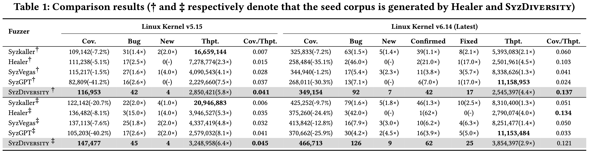

# 🧩 Experimental Evaluation: Results & Data Overview

This directory provides a comprehensive overview of all experimental evaluations (RQ1–RQ4) in the paper, including raw data and visualizations for each research question.

- **RQ1–RQ3**: Each experiment runs for **72 hours** and is repeated **three times** to reduce the impact of randomness and ensure reliability.
- **RQ4**: Focuses on selecting the best hyper-parameters. Since SyzDiversity performs well in the first 24 hours of RQ1–RQ3, each group in RQ4 is evaluated with **three independent 24-hour runs**.

---

## 📁 Directory Structure & Description

| Research Question            | Folder                                                              | Description                             |
|-----------------------------|---------------------------------------------------------------------|-----------------------------------------|
| 🏆 RQ1 Effectiveness Evaluation | [rq1_effectiveness_evaluation](./rq1_effectiveness_evaluation/)   | Coverage growth & triggered bug records |
| 🚀 RQ2 Efficiency Evaluation    | [rq2_efficiency_evaluation](./rq2_efficiency_evaluation/)         | Throughput growth data                  |
| 🧪 RQ3 Ablation Study           | [rq3_ablation_study](./rq3_ablation_study/)                       | Ablation experiment data                |
| ⚙️ RQ4 Parameter Study          | [rq4_parameter_sensitive](./rq4_parameter_sensitive/)              | Best hyper-parameter data               |

---

For detailed data and experimental settings, please refer to the README inside each subfolder.
