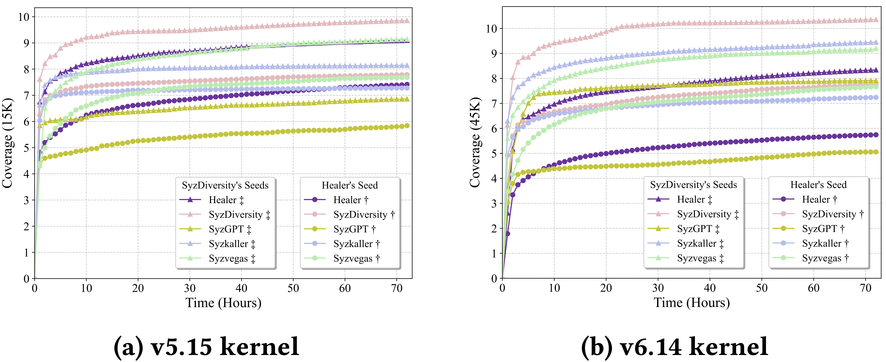

# 🧪 RQ1 Effectiveness Evaluation Data



This directory contains all experimental data for **RQ1: Effectiveness Evaluation** as presented in our paper.

It consists of **two subfolders**:

- **[Bug Title](./Bug%20Title/)**: The triggered bugs by each fuzzer.
- **[Data](./Data/)**: 72-hour experimental coverage growth.

---

## 📁 Data Structure

1. **This directory contains two subfolders:**
   - `Bug Title`
   - `Data`

2. **Bug Title**
   - This folder collects the record with the highest number of triggered bugs from three trials for each experiment.
   - It contains **five subfolders**, each corresponding to a fuzzer:
     - [Syzkaller](./Bug%20Title/Syzkaller/)
     - [Healer](./Bug%20Title/Healer/)
     - [SyzVegas](./Bug%20Title/Syzvegas/)
     - [SyzGPT](./Bug%20Title/SyzGPT/)
     - [SyzDiversity](./Bug%20Title/SzyDiversity/)
   - Each fuzzer subfolder contains **four experiment settings**:
     - **2 kernel versions** (`v5.15`, `v6.14`)
     - **2 initial seeds** (`Healer's Seed`, `SyzDiversity's Seed`)

3. **Data**
   - This folder contains **20 subfolders** (5 fuzzers × 2 kernels × 2 seeds).
   - Each subfolder is named as:
     ```
     [Fuzzer]-linux[version]-[Seed Type]
     ```
     For example: `Healer-linux5.15-Healer Seed`
   - Each subfolder includes **three CSV files**, representing three independent experimental runs.

---

## 🗂️ Quick Navigation

#### Bug Title

- [Syzkaller](./Bug%20Title/Syzkaller/)
- [Healer](./Bug%20Title/Healer/)
- [SyzVegas](./Bug%20Title/Syzvegas/)
- [SyzGPT](./Bug%20Title/SyzGPT/)
- [SyzDiversity](./Bug%20Title/SzyDiversity/)

#### Data

- [Healer-linux5.15-Healer Seed](./Data/Healer-linux5.15-Healer%20Seed/)
- [Healer-linux5.15-Our Seed](./Data/Healer-linux5.15-Our%20Seed/)
- [Healer-linux6.14-Healer Seed](./Data/Healer-linux6.14-Healer%20Seed/)
- [Healer-linux6.14-Our Seed](./Data/Healer-linux6.14-Our%20Seed/)
- [SyzDiversity-linux5.15-Healer Seed](./Data/SyzDiversity-linux5.15-Healer%20Seed/)
- [SyzDiversity-linux5.15-Our Seed](./Data/SyzDiversity-linux5.15-Our%20Seed/)
- [SyzDiversity-linux6.14-Healer Seed](./Data/SyzDiversity-linux6.14-Healer%20Seed/)
- [SyzDiversity-linux6.14-Our Seed](./Data/SyzDiversity-linux6.14-Our%20Seed/)
- [SyzGPT-linux5.15-Healer Seed](./Data/SyzGPT-linux5.15-Healer%20Seed/)
- [SyzGPT-linux5.15-Our Seed](./Data/SyzGPT-linux5.15-Our%20Seed/)
- [SyzGPT-linux6.14-Healer Seed](./Data/SyzGPT-linux6.14-Healer%20Seed/)
- [SyzGPT-linux6.14-Our Seed](./Data/SyzGPT-linux6.14-Our%20Seed/)
- [Syzkaller-linux5.15-Healer Seed](./Data/Syzkaller-linux5.15-Healer%20Seed/)
- [Syzkaller-linux5.15-Our Seed](./Data/Syzkaller-linux5.15-Our%20Seed/)
- [Syzkaller-linux6.14-Healer Seed](./Data/Syzkaller-linux6.14-Healer%20Seed/)
- [Syzkaller-linux6.14-Our Seed](./Data/Syzkaller-linux6.14-Our%20Seed/)
- [Syzvegas-linux5.15-Healer Seed](./Data/Syzvegas-linux5.15-Healer%20Seed/)
- [Syzvegas-linux5.15-Our Seed](./Data/Syzvegas-linux5.15-Our%20Seed/)
- [Syzvegas-linux6.14-Healer Seed](./Data/Syzvegas-linux6.14-Healer%20Seed/)
- [Syzvegas-linux6.14-Our Seed](./Data/Syzvegas-linux6.14-Our%20Seed/)

---
