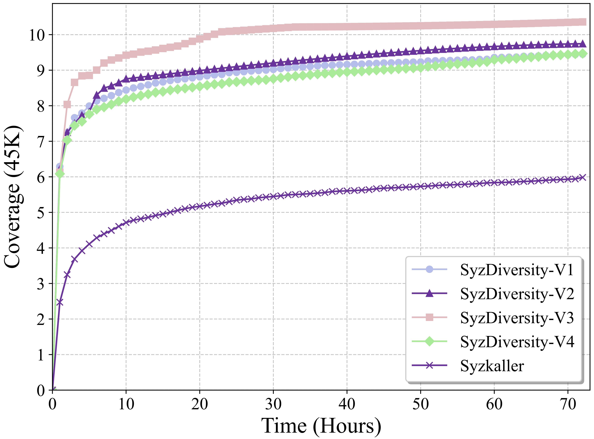

# 🧪 RQ3 Ablation Study Data

This directory contains all experimental data for **RQ3: Ablation Study** as presented in our paper.

---

## 📁 Data Structure

It consists of **five subfolders**, each corresponding to an ablation variant described in the paper:

- **[SyzDiversity-V1](./SyzDiversity-V1/)**: Only includes the coverage-guided fuzzer with the constructed initial seed corpus.
- **[SyzDiversity-V2](./SyzDiversity-V2/)**: On top of V1, adds CPR-Aware scheduling.
- **[SyzDiversity-V3](./SyzDiversity-V3/)**: On top of V2, adds CPR-Mutation strategy.
- **[SyzDiversity-V4](./SyzDiversity-V4/)**: Combines V1 with the low-density guided SyzDiversity.
- **[Syzkaller](./Syzkaller/)**: The original Syzkaller fuzzer.

- **Each subfolder** corresponds to a specific fuzzer variant used in the ablation study.  
  Each folder contains **three CSV files**, representing the coverage growth results of three independent 72-hour experimental runs.
---

## 🗂️ Quick Navigation

- [SyzDiversity-V1](./SyzDiversity-V1/)
- [SyzDiversity-V2](./SyzDiversity-V2/)
- [SyzDiversity-V3](./SyzDiversity-V3/)
- [SyzDiversity-V4](./SyzDiversity-V4/)
- [Syzkaller](./Syzkaller/)

---

