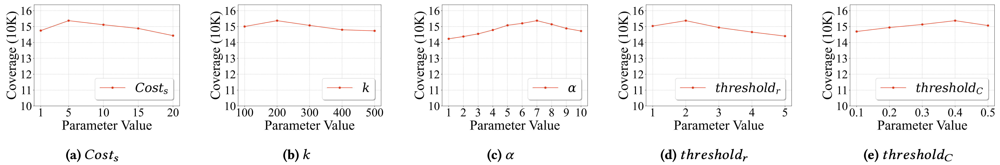

# 🧪 RQ4 Parameter Sensitivity Experimental Data

This directory contains all experimental data for **RQ4: Parameter Sensitivity Analysis** as presented in our paper.  
It consists of 5 subfolders, each corresponding to a key parameter analyzed in RQ4:

| Folder                                   | Parameter Description                                   |
|:------------------------------------------|:--------------------------------------------------------|
| [💰 cost](./cost/)                        | Results for different values of the $Cost_s$ Parameter        |
| [🔑 k](./k/)                              | Results for different values of the $k$ Parameter        |
| [🔠 alpha](./alpha/)                      | Results for different values of the $\alpha$ Parameter              |
| [🏅 rank](./rank/)                        | Results for different values of the $threshold_r$ Parameter    |
| [🚦 threshold_c](./threshold_c/)          | Results for different values of the $threshold_c$ Parameter    |

---

## ⚠️ Note on Figure

> **Important:**  
> There was a minor mistake when drawing the above experimental figure—**the actual unit for each y-axis is 30K**.  
> We sincerely apologize for any confusion this may have caused.

---

## 📊 Data Structure

- Each parameter folder contains **3 `.csv` files**, corresponding to three independent 24-hour experimental runs.
- Each `.csv` file records the tested parameter values and the corresponding coverage at the 24-hour mark.
- Since RQ1 already demonstrated the coverage trends over time, RQ4 only reports the **final coverage at 24 hours** for concise comparison.

---

## 🗂️ Quick Navigation

- [cost/](./cost/)
- [k/](./k/)
- [alpha/](./alpha/)
- [rank/](./rank/)
- [threshold_c/](./threshold_c/)

---
